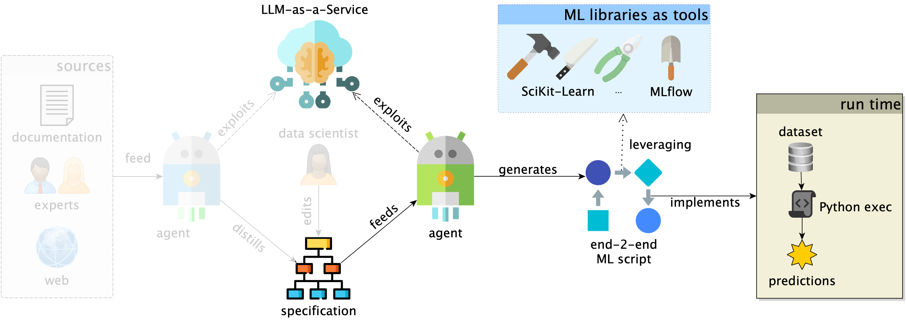
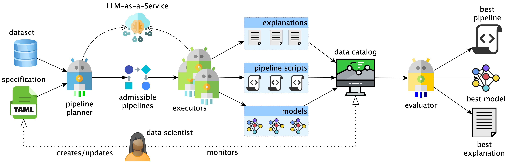
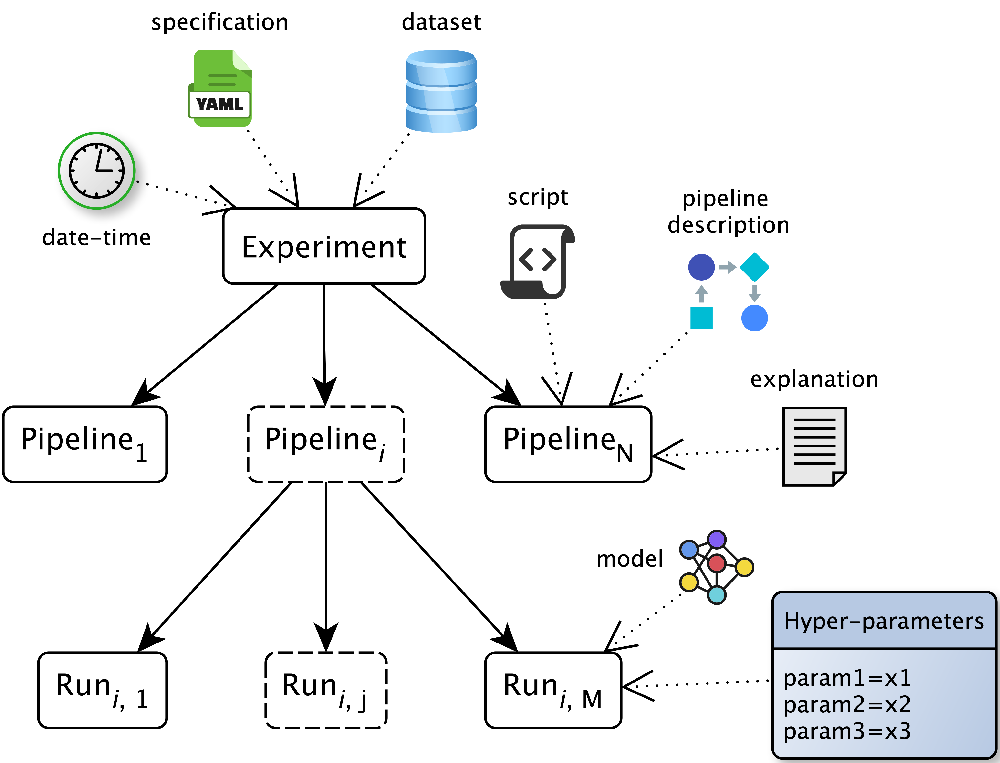
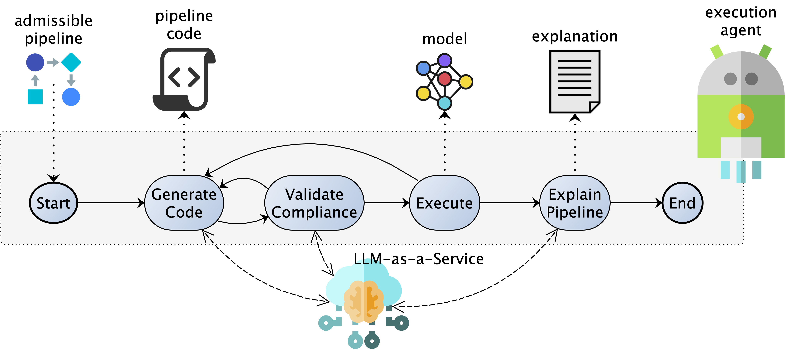

# Data-Centric AI: Main Point

Data-Centric AI shifts attention from only tuning models to improving the data and preprocessing choices that shape model behavior [@zha2025data].

**For practitioners, that means:**

- Data properties should influence pipeline structure
- Domain assumptions should be explicit, reusable, and inspectable
- Automation should reduce routine work without hiding critical decisions

::: {.notes}
Keep this as the first conceptual anchor: the paper starts from the data-centric
view. Human knowledge is valuable because preprocessing and validation decisions
often determine whether an ML workflow is robust.
:::

# Background: AutoML and Agents

**AutoML** gives algorithmic search

- Automates (only) model selection and hyperparameter optimization [@he2021automl]
  - Classic systems include TPOT, Auto-WEKA, and Auto-Sklearn
  [@olson2016tpot; @DBLP:conf/kdd/ThorntonHHL13; @DBLP:journals/jmlr/FeurerEFLH22]
- Efficient and end-to-end variants include FLAML and HAMLET
  [@DBLP:conf/kdd/0001W0Q22; @FranciaGP23]

**Agentic AI** gives generation and adaptation

- Uses LLM-backed agents for planning, code generation, validation, and repair
  - Recent examples include DS-Agent, MLZero, and AutoML-Agent
  [@DBLP:conf/icml/GuoD0C0024; @DBLP:journals/corr/abs-2505-13941; @DBLP:conf/icml/TriratJH25]
- Needs specifications and guardrails to stay auditable

**Data scientists** augment knowledge to drive selection and optimization

- End-to-end AutoML [@FranciaGP23; @DBLP:conf/pakdd/FranciaGG24] and LLM-driven agents
[@DBLP:conf/icml/TriratJH25], but controllability and traceability remain open problems.

# AGE-ML in One Slide

{.center-img}

Given external domain knowledge (if any), LLM-powered agents distill human-readable specifications describing assumptions and constraints

- If no knowledge is provided, we start with classic ML specification
- Specification is written in YAML

# AGE-ML in One Slide

{.center-img}

Data scientists (and experts) can read, revise, and manually augment the specification 

- The search space is not just optimized by algorithms, it is **shaped** by experts.

# AGE-ML in One Slide

{.center-img}

Planner and executor agents generate, validate, repair, and run pipelines under the constraints imposed by the specification.

- Agents can synthesize and adapt code, but they work inside an explicit search space rather than freely inventing the workflow.
- AGE-ML returns trained pipelines together with code, metrics, artifacts, and natural-language explanations for audit and reuse.
- The output is not only a score or a model. It is a governed ML process with traceable evidence

# Specification in, governed pipelines out.

{.center-img}

::: columns
::: {.column width="25%"}
**Planner**

Specification to admissible pipelines (admissibility as a finite-domain **constraint satisfaction
problem**, **Z3** to compute admissible pipelines).
:::

::: {.column width="25%"}
:::{.fragment}
**Executor**

From pipelines to code, runs, and explanations
:::
:::

::: {.column width="25%"}
:::{.fragment}
**Catalog**

Collect scripts, metrics, artifacts, traces
:::
:::

::: {.column width="25%"}
:::{.fragment}
**Evaluator**

Best model under the budget
:::
:::
:::

# Feature Comparison

| Feature | HAMLET [@FranciaGP23] | FLAML [@DBLP:conf/kdd/0001W0Q22] | DS-Agent [@DBLP:conf/icml/GuoD0C0024] | AutoML-Agent [@DBLP:conf/icml/TriratJH25] | MLZero [@DBLP:journals/corr/abs-2505-13941] | **AGE-ML** |
|---|---:|---:|---:|---:|---:|---:|
| End-to-end pipeline | **Yes** | No | **Yes** | **Yes** | **Yes** | **Yes** |
| Human-centered design | **Yes** | No | No | No | No | **Yes** |
| Constrained generation | **Yes** | **Yes** | No | No | No | **Yes** |
| Pipeline validation | **Yes** | No | **Yes** | **Yes** | **Yes** | **Yes** |
| Interpretable pipeline | No | No | **Yes** | **Yes** | **Yes** | **Yes** |
| Zero-data cold start | **Yes** | **Yes** | No | No | No | **Yes** |
| MLOps oriented | No | No | No | No | No | **Yes** |

AGE-ML is positioned as the approach that combines **end-to-end automation**,
**explicit constraints**, **pipeline validation**, and **MLOps-oriented
traceability**.

::: {.notes}
The point is not that every other system lacks value. The comparison highlights
the particular combination AGE-ML targets: constrained generation with LLM-backed
automation, interpretable pipelines, cold-start capabilities, and auditable
execution traces.
:::


# Evaluation Setup

| Task | Datasets | Metric |
|---|---:|---|
| Classification | Wilt, Texture, Madelon, HAR, Adult, MNIST_784 | Balanced accuracy |
| Regression | Ames Housing, California Housing, Auto MPG | RMSE |

| Budget item | Value |
|---|---:|
| Pipelines | 30 |
| Parallel workers | 8 |
| Generation attempts per pipeline | 10 |
| Total runtime per run | 2 hours |

**Baseline construction**

| Dataset group | Baseline source |
|---|---|
| Classification datasets | HAMLET, a state-of-the-art AutoML system |
| Ames Housing | Published Kaggle notebook by Gus Martins |
| California Housing | Published Kaggle notebook by Ahmed Mahmoud |
| Auto MPG | Published Kaggle notebook by Ertugrul Demir |

::: {.notes}
Keep this short. The goal is to make the results credible without spending the
talk inside experimental setup. Clarify that regression baselines come from
published notebooks because HAMLET is not available for those cases in the
paper's comparison setup.
:::

# Results at a Glance

| Model | Beats baseline on | Pattern |
|---|---:|---|
| Gemini 3.1 Flash Lite | 5 / 9 datasets | More valid pipelines, lower output tokens |
| Gemini 2.5 Flash | 4 / 9 datasets | Competitive, but fewer valid pipelines on harder cases |

**Strongest signals**

- HAR and Adult improve for both models
- California Housing and Auto MPG improve for both models
- Ames Housing remains challenging

::: {.notes}
This is the slide to say "competitive under constraints" rather than claiming
universal dominance. The model comparison also supports the paper's argument:
validity and executability are central bottlenecks.
:::

# Detailed Results

| Dataset | Gemini 3.1 FL | Baseline | Gemini 2.5 F |
|---|---:|---:|---:|
| Wilt | **0.983** | 0.975 | 0.966 |
| Texture | 0.992 | 0.997 | 0.995 |
| Madelon | 0.863 | 0.875 | 0.863 |
| HAR | **0.987** | 0.959 | **0.981** |
| Adult | **0.822** | 0.805 | **0.813** |
| MNIST_784 | 0.971 | 0.972 | 0.966 |
| California Housing | **67,675.641** | 69,838.844 | **69,331.032** |
| Ames Housing | 30,189.152 | 29,660.363 | 31,970.630 |
| Auto MPG | **2.148** | 2.508 | **2.283** |

Classification uses balanced accuracy, so higher is better. Regression uses
RMSE, so lower is better.

::: {.notes}
If time is tight, skip row-by-row discussion. Point out where the bold numbers
are and connect back to coordinated preprocessing and valid pipeline generation.
:::

# What We Learn

1. **Specification narrows automation without removing flexibility.**

2. **Symbolic planning keeps the search space inspectable.**

3. **The validation loop matters as much as the LLM.**

4. **The catalog turns generated ML work into governed ML work.**

::: {.notes}
This is the synthesis slide. It converts the paper's components into takeaways.
:::

# Limitations and Next Steps

**Current limitations**

- One coherent specification is assumed
- LLM generation can fail under strict time and retry budgets
- Results may vary across repeated runs

**Future work**

- Agent-assisted specification authoring
- Modular and reusable specification fragments
- Human editing with selective re-execution
- Better budget sensitivity analysis and prompt compression
- Direct evaluation of data cleaning and bias mitigation

::: {.notes}
Be candid here. ADBIS audiences usually appreciate clear scoping and a
roadmap grounded in engineering realities.
:::

# Make AutoML Inspectable

::: {.r-fit-text}
Not magic.

Not manual.

**A governed loop between data, constraints, agents, and evidence.**
:::

::: {.notes}
Catchy ending: "The future of AutoML is not a larger black box. It is an
inspectable loop where human knowledge shapes what automation is allowed to do."
:::

# Thank You

**Questions?**

Repository: <https://github.com/Mala1180/age-ml>

::: {.r-fit-text}
**Let agents explore. Let specifications decide.**
:::


# Specification as Control Surface

```yaml
pipeline:
  steps:
    normalization:
      candidates:
        min-max:
          params: {feature_range: [[0, 1]]}
    classification:
      mandatory: true
      candidates:
        knn:
          params:
            n_neighbors: [5, 11]
            weights: [uniform, distance]
ordering:
  - sequence: [imputation, normalization, features]
  - {before: features, after: classification}
constraints:
  - if: {step: {classification: knn}}
    require: [normalization, features]
budgets:
  pipelines: 5
  generation_attempts: 10
```

::: {.notes}
Do not dwell on syntax. Emphasize readability: YAML-like, parsable, and suitable
for both human editing and agent-assisted generation or revision.
:::

# Traceability Is a First-Class Result

{.center-img}

Every experiment records:

- The specification and dataset context
- Each admissible pipeline selected by the planner
- Generated scripts, hyperparameters, metrics, artifacts, and explanations

This gives MLOps-style provenance for agent-generated ML work.

::: {.notes}
This is where the system becomes more than a benchmark runner. The audience
should see that AGE-ML tries to make agentic automation auditable.
:::

# Execution: The Agentic Loop

{.center-img}

Generated code must pass two gates:

- **Semantic validation:** implements exactly the intended pipeline
- **Runtime validation:** trains and evaluates under the execution budget

Failures become feedback for bounded repair attempts.

::: {.notes}
The important point is that code generation is not single-shot. Generation,
checking, execution, and explanation are one loop, bounded by the specification
and the budget.
:::

# References