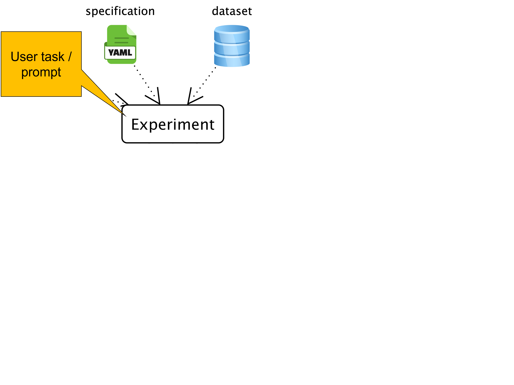
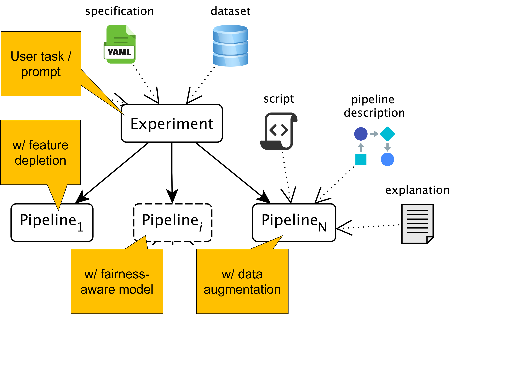
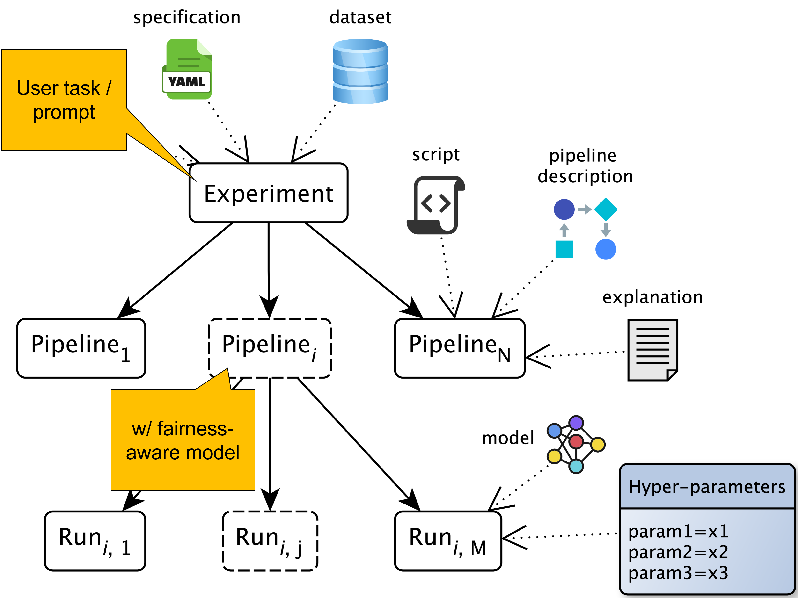
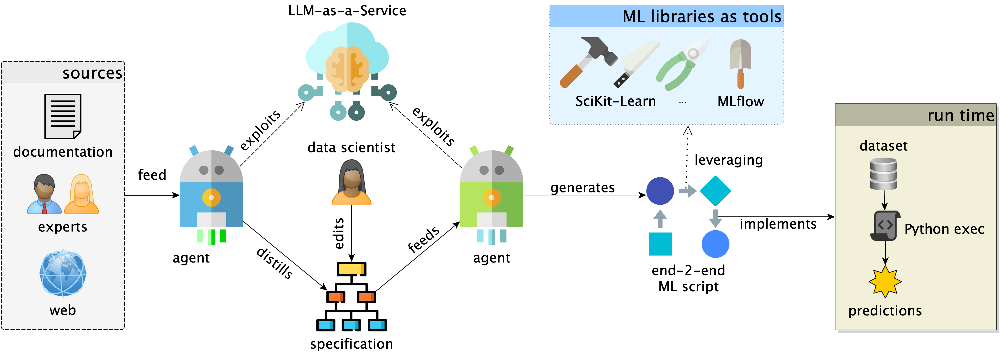

# Automating Data-Centric AI in the agentic era

Data-Centric AI shifts attention from tuning models to improving the data choices that shape model behavior [@zha2025data].

::: {.fragment}
Which role should **agents** and **generative AI** play in this process?

- Vibe coding is a reality: Agents are powerful end-to-end pipeline generators. 
- However, DC-AI requires domain and quality assumptions to be reusable, inspectable, and traceable
- ... and automation should reduce routine work without hiding critical decisions
:::

::: {.fragment}
What about vibe data analysis?

- Help data scientists improve their data pipelines by also injecting domain knowledge and constraints
- ... unconstrained generation is hard to trust

**Idea**: augment the generation process with specifications and constraints to make generated pipelines inspectable and accountable.
:::

# AutoML, Agents, and Data Scientists

**AutoML** gives algorithmic search

- Automates (only) model selection and hyperparameter optimization [@he2021automl]
  - Classic systems include TPOT, Auto-WEKA, and Auto-Sklearn
  [@olson2016tpot; @DBLP:conf/kdd/ThorntonHHL13; @DBLP:journals/jmlr/FeurerEFLH22]
- Efficient and end-to-end variants include FLAML and HAMLET
  [@DBLP:conf/kdd/0001W0Q22; @FranciaGP23]

::: {.fragment}
**Agentic AI** gives generation and adaptation

- Uses LLM-backed agents for planning, code generation, validation, and repair
  - Recent examples include DS-Agent, MLZero, and AutoML-Agent
  [@DBLP:conf/icml/GuoD0C0024; @DBLP:journals/corr/abs-2505-13941; @DBLP:conf/icml/TriratJH25]
- Needs specifications and guardrails to stay auditable
:::

::: {.fragment}
**Data scientists** augment knowledge to drive selection and optimization

- End-to-end AutoML [@FranciaGP23; @DBLP:conf/pakdd/FranciaGG24] and LLM-driven agents
[@DBLP:conf/icml/TriratJH25], but controllability and traceability remain open problems.
:::

## AGE-ML: Specifications Define the Search Space

{.center-img}

*"Knowing that gender and location are sensitive attributes, predict the outcome and verify the results should not depend on them"*

- A standard specification is provided, including classic ML steps (written in YAML)
- LLM-powered agents distill human-readable specifications describing assumptions and constraints.
  - E.g., possible solutions are: *feature depletion*, *data augmentation* or *pseudonymization*, *fairness-aware models*, or *post-hoc metrics*.

## AGE-ML: Specifications Keep Experts in the Loop

{.center-img}

*"Wait! I know that this dataset is unbalanced and this might introduce bias. Make sure the model is robust to this."*

- E.g. prefer some algorithms over others, or require mandatory specific preprocessing steps.

## AGE-ML: Agents Work Inside the Specification

{.center-img}

Planner and executor agents generate, validate, and run pipelines under the constraints imposed by the specification.

- Agents synthesize and adapt code inside an explicit search space and returnsa governed ML process with traceable evidence. 
- AGE-ML returns pipelines together with metrics, artifacts, and natural-language decription for audit and reuse.

# Specification In, Governed Pipelines Out

{.center-img}

::: columns
::: {.column width="25%"}
**Planner**

Specification to admissible pipelines (admissibility as a finite-domain **constraint satisfaction problem**, **Z3** to compute admissible pipelines).
:::

::: {.column width="25%"}
:::{.fragment}
**Executor**

From pipelines to code, runs, and explanations
:::
:::

::: {.column width="25%"}
:::{.fragment}
**Catalog**

Collect metrics, artifacts, traces
:::
:::

::: {.column width="25%"}
:::{.fragment}
**Evaluator**

Best model under the budget
:::
:::
:::

# Generated Code Must Prove Itself

:::: {.columns}
::: {.column width="45%"}
Generated code must pass two gates:

- **Semantic validation:** implements the pipelines that do not violate the specification and conflicting constraints (e.g., feature depletion and post-hoc metrics on depleted features).
- **Runtime validation:** trains/evaluates under execution budget.

Failures become feedback for bounded repair attempts.
:::

::: {.column width="55%"}
{.center-img}
:::
::::

# Every Decision Becomes Audit Evidence

{.center-img}

# Every Decision Becomes Audit Evidence

{.center-img}

# Every Decision Becomes Audit Evidence

{.center-img}

# What We Learn

Agents generate pipelines. Specifications keep them accountable.

1. **Specifications define the admissible search space.**
2. **Validation makes generated code prove it implements the intended pipeline.**
3. **Traceability turns every decision into audit evidence.**
4. **Results are competitive.**

Experiment setup

- *Datasets*: 6 (*Classification*) + 3 (*Regression*)
- *Budget*: 30 pipelines, 10 generation attempts per pipeline, 2 hours per run
- *Baselines*: HAMLET / FLAML (AutoML) / Kaggle notebooks
- AGE-ML (w/ Gemini 3.1 Flash Lite) beats the competitors on 67% of the datasets

# Limitations and Future Work

**Current limitations**

- One coherent specification is assumed, but specifications evolve over time and must be revised
- LLM generation can fail under strict time and retry budgets

**Future work**

- Support specification evolution and revision
- Enable iterative feedback on pipeline execution and optimization
- Suggest specification extensions and refinements after pipeline execution

# Thank You

{.center-img}

**Agents generate pipelines. Specifications keep them accountable.**

# Specification as Control Surface

```yaml
pipeline:
  steps:
    normalization:
      candidates:
        min-max:
          params: {feature_range: [[0, 1]]}
    classification:
      mandatory: true
      candidates:
        knn:
          params:
            n_neighbors: [5, 11]
            weights: [uniform, distance]
ordering:
  - sequence: [imputation, normalization, features]
  - {before: features, after: classification}
constraints:
  - if: {step: {classification: knn}}
    require: [normalization, features]
budgets:
  pipelines: 5
  generation_attempts: 10
```

::: {.notes}
Do not dwell on syntax. Emphasize readability: YAML-like, parsable, and suitable
for both human editing and agent-assisted generation or revision.
:::

# Feature Comparison

| Feature | HAMLET [@FranciaGP23] | FLAML [@DBLP:conf/kdd/0001W0Q22] | DS-Agent [@DBLP:conf/icml/GuoD0C0024] | AutoML-Agent [@DBLP:conf/icml/TriratJH25] | MLZero [@DBLP:journals/corr/abs-2505-13941] | AGE-ML |
|---|---:|---:|---:|---:|---:|---:|
| End-to-end pipeline | ✅ | ❌ | ✅ | ✅ | ✅ | ✅ |
| Domain-knowledge injection | ✅ | ❌ | ❌ | ❌ | ❌ | ✅ |
| Constrained generation | ✅ | ✅ | ❌ | ❌ | ❌ | ✅ |
| Pipeline validation | ✅ | ❌ | ✅ | ✅ | ✅ | ✅ |
| Interpretable pipeline | ❌ | ❌ | ✅ | ✅ | ✅ | ✅ |
| Zero-data cold start | ✅ | ✅ | ❌ | ❌ | ❌ | ✅ |
| MLOps oriented | ❌ | ❌ | ❌ | ❌ | ❌ | ✅ |

AGE-ML is positioned as the approach that combines **end-to-end automation**,
**explicit constraints**, **pipeline validation**, and **MLOps-oriented traceability**.

# Competitive Performance with a Governed Process

:::: {.columns}

::: {.column width="50%"}
**Evaluation setup**

- *Datasets*: 6 (*Classification*) + 3 (*Regression*)
- *Metrics*: balanced accuracy for classification; RMSE for regression
- *Budget*: 30 pipelines, 10 generation attempts per pipeline, 2 hours per run
- *Baselines*: HAMLET for classification (closest approach for domain knowledge injection); Kaggle notebooks for regression

**Results at a glance**

- AG-ML w/ Gemini 3.1 Flash Lite beats the baseline on **5 / 9 datasets**
- AG-ML w/ Gemini 2.5 Flash beats the baseline on **4 / 9 datasets**
:::
::: {.column width="50%"}

**Detailed results**

|Task| Dataset | Gemini 3.1 FL | Baseline | Gemini 2.5 F |
|---|---|---:|---:|---:|
|Classification| Wilt | **0.983** | 0.975 | 0.966 |
|| Texture | 0.992 | **0.997** | 0.995 |
|| Madelon | 0.863 | **0.875** | 0.863 |
|| HAR | **0.987** | 0.959 | *0.981* |
|| Adult | **0.822** | 0.805 | *0.813* |
|| MNIST_784 | **0.972** | **0.972** | 0.966 |
|Regression| California Housing | **67,675** | 69,838 | *69,331* |
|| Ames Housing | 30,189 | **29,660.363** | 31,970 |
|| Auto MPG | **2.148** | 2.508 | *2.283* |
:::
::::

# References
